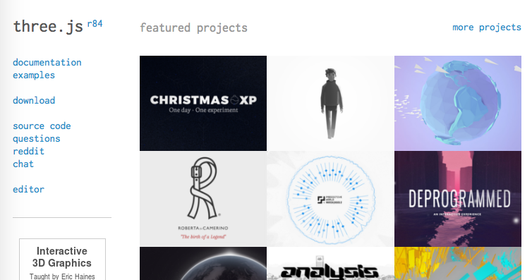
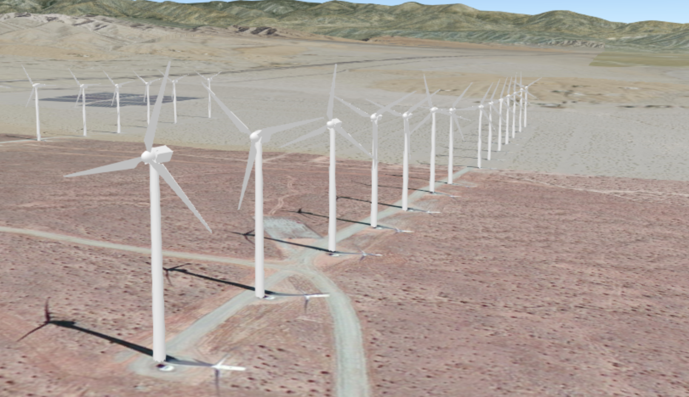
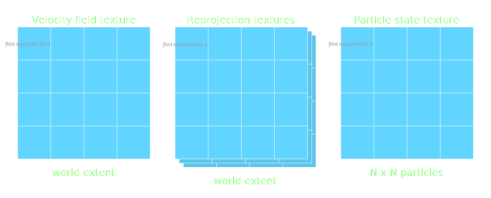
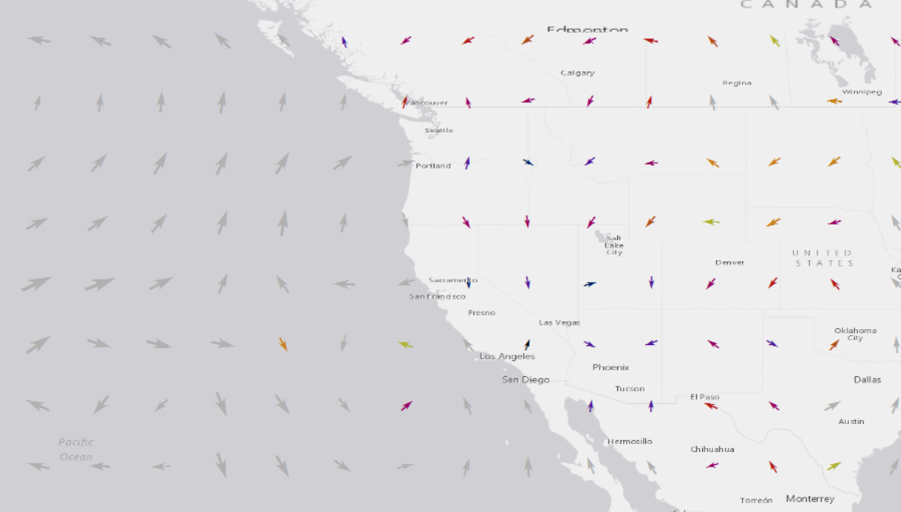

<!-- .slide: data-background="images/title.png" -->

# Extending the ArcGIS API
# for JavaScript's 3D engine

 

Jesse van den Kieboom, ESRI R&amp;D Center Zürich

---

## Important Notice

These slides contain dynamic code snippets that can be viewed online. See https://jkieboom.github.io/presentations-devsummit-2017/extending-3d-engine.

---

## Table of contents

1. When to extend the 3D engine
1. Basic concepts and API
1. Integration with three.js
1. Advanced data visualization

---

<!-- .slide: data-background="images/section.png" -->

## When to extend the 3D engine

---

## When to extend the 3D engine

- You have data that you cannot visualize with available renderers, methods
- You want visualizations/animations that are not (yet) available
- You are familiar with WebGL and can afford the development effort
- **Important disclaimer: Experimental</red>!**

---

## When to extend the 3D engine

Eearth Magnetic Field (APL)

<video height="450px" autoplay="yes" controls="yes" loop="yes">
  <source data-src="./movies/earth-magnetic-field.mp4" type="video/mp4"/>
</video>

https://github.com/richiecarmichael/Esri-Earth-Magnetic-Field
http://richiecarmichael.github.io/mag/index.html

---

## When to extend the 3D engine

Earthquakes (APL)

<video height="450px" autoplay="yes" controls="yes" loop="yes">
  <source data-src="./movies/earth-quakes.mp4" type="video/mp4"/>
</video>

https://github.com/richiecarmichael/Esri-Quake-Map
http://richiecarmichael.github.io/quake/index.html

---

## When to extend the 3D engine

Satellites (APL)

<video height="450px" autoplay="yes" controls="yes" loop="yes">
  <source data-src="./movies/satellites.mp4" type="video/mp4"/>
</video>

https://github.com/richiecarmichael/Esri-Satellite-Map
http://richiecarmichael.github.io/sat/index.html

---

## When to extend the 3D engine

International Space Station (three.js, JS API sample)

<video height="450px" autoplay="yes" controls="yes" loop="yes">
  <source data-src="./movies/ISS.mp4" type="video/mp4"/>
</video>

https://developers.arcgis.com/javascript/latest/sample-code/scene-external-renderer-threejs/index.html

---

## When to extend the 3D engine

Windmills (JS API sample)

<video height="450px" autoplay="yes" controls="yes" loop="yes">
  <source data-src="./movies/windmills.mp4" type="video/mp4"/>
</video>

https://developers.arcgis.com/javascript/latest/sample-code/scene-external-renderer/index.html

---

## When to extend the 3D engine

Global wind currents

<video height="450px" autoplay="yes" controls="yes" loop="yes">
  <source data-src="./movies/wind-particle-flow.mp4" type="video/mp4"/>
</video>

---

<!-- .slide: data-background="images/section.png" -->

## Basic concepts and API

---

## Basic concepts and API

- More involved than rendering your own additional graphics in 2D
- WebGL context and state
- Render coordinate system
- Camera and lighting
- Dealing with precision issues

---

## Basic concepts and API

- Main interface: `require("esri/views/3d/externalRenderers")`

https://developers.arcgis.com/javascript/latest/api-reference/esri-views-3d-externalRenderers.html

---

## Hands-on, render coordinate system

  

  <pre><code class="lang-ts hljs typescript">

// Get the 3D coordinate transform (4x4 matrix)
// at a map point
const transform = externalRenderers
    .renderCoordinateTransformAt(
      view,

      // Map point
      [point.x, point.y, point.z],

      // Spatial reference of the point
      point.spatialReference,

      // Optional: pre-allocated output array
      null
    );
</code></pre>
  <!--<svg data-play-frame="frame-basic-render-coordinate-system" class="play-code" viewBox="0 0 24 24"><path fill="#999" d="M12,20.14C7.59,20.14 4,16.55 4,12.14C4,7.73 7.59,4.14 12,4.14C16.41,4.14 20,7.73 20,12.14C20,16.55 16.41,20.14 12,20.14M12,2.14A10,10 0 0,0 2,12.14A10,10 0 0,0 12,22.14A10,10 0 0,0 22,12.14C22,6.61 17.5,2.14 12,2.14M10,16.64L16,12.14L10,7.64V16.64Z" /></svg>-->
  

  

    <iframe id="frame-basic-render-coordinate-system" data-src="./snippets/snippet.html?01-basic-render-coordinate-system"></iframe>
  

---

## Hands-on, camera and lighting

  

  <pre><code class="lang-glsl hljs glsl">

vec3 transformedNormal =
  normalize(uNormalMatrix \* aVertexNormal);

float directionalLightWeighting =
  max(dot(transformedNormal, uLightingDirection), 0.0);

vLightColor = uAmbientColor +
  uDirectionalColor \* directionalLightWeighting;

</code></pre>
  <!--<svg data-play-frame="frame-basic-camera-and-lighting" class="play-code" viewBox="0 0 24 24"><path fill="#999" d="M12,20.14C7.59,20.14 4,16.55 4,12.14C4,7.73 7.59,4.14 12,4.14C16.41,4.14 20,7.73 20,12.14C20,16.55 16.41,20.14 12,20.14M12,2.14A10,10 0 0,0 2,12.14A10,10 0 0,0 12,22.14A10,10 0 0,0 22,12.14C22,6.61 17.5,2.14 12,2.14M10,16.64L16,12.14L10,7.64V16.64Z" /></svg>-->
  

  

    <iframe id="frame-basic-camera-and-lighting" data-src="./snippets/snippet.html?02-basic-camera-and-lighting"></iframe>
  

- [externalRenderers#RenderCamera](https://developers.arcgis.com/javascript/latest/api-reference/esri-views-3d-externalRenderers.html#RenderCamera)
- [externalRenderers#SunLight](https://developers.arcgis.com/javascript/latest/api-reference/esri-views-3d-externalRenderers.html#SunLight)

---

## Hands-on, dealing with precision issues

  

  <pre><code class="lang-ts hljs typescript">
    const modelMatrix = externalRenderers
      .renderCoordinateTransformAt(
        view, [x, y, z], sr, null
      );

    // Subtract local origin from
    // the modelMatrix
    modelMatrix[12] -= origin[0];
    modelMatrix[13] -= origin[1];
    modelMatrix[14] -= origin[2];

    // ...

    // When rendering, translate viewMatrix
    // by local origin
    const viewMatrix = mat4.translate(
      new Array(16), camera.viewMatrix, origin
    );
</code></pre>
  <!--<svg data-play-frame="frame-basic-camera-and-lighting" class="play-code" viewBox="0 0 24 24"><path fill="#999" d="M12,20.14C7.59,20.14 4,16.55 4,12.14C4,7.73 7.59,4.14 12,4.14C16.41,4.14 20,7.73 20,12.14C20,16.55 16.41,20.14 12,20.14M12,2.14A10,10 0 0,0 2,12.14A10,10 0 0,0 12,22.14A10,10 0 0,0 22,12.14C22,6.61 17.5,2.14 12,2.14M10,16.64L16,12.14L10,7.64V16.64Z" /></svg>-->
  

  

    <iframe id="frame-basic-precision" data-src="./snippets/snippet.html?03-basic-precision"></iframe>
  

---

## Integration with three.js

- Working with pure WebGL can be cumbersome
- Use a higher level abstraction
- three.js is a popular 3D rendering library for WebGL

(https://threejs.org/)

---

## Integration with three.js

Some samples and featured projects:

- http://data-arts.appspot.com/globe/
- http://www.gsmlondon.ac.uk/global-oil-map/
- https://threejs.org/examples/#webgl_shaders_ocean2

---

## Hands-on, three.js &mdash; Renderer integration

  

  <pre><code class="lang-ts hljs typescript">
const geometry =
  new THREE.BoxBufferGeometry(size, size, size);

const material =
  new THREE.MeshPhongMaterial({ color: "#00f" });

const m = new THREE.Mesh(geometry, material);

const transform = new THREE.Matrix4();

externalRenderers.renderCoordinateTransformAt(
  view,
  [location.x, location.y, location.z],
  location.spatialReference,
  transform.elements
);

transform.decompose(m.position, m.quaternion,
  m.scale);

scene.add(m);
externalRenderers.requestRender(view);
</code></pre>
  <svg data-play-frame="frame-basic-threejs" class="play-code" viewBox="0 0 24 24"><path fill="#999" d="M12,20.14C7.59,20.14 4,16.55 4,12.14C4,7.73 7.59,4.14 12,4.14C16.41,4.14 20,7.73 20,12.14C20,16.55 16.41,20.14 12,20.14M12,2.14A10,10 0 0,0 2,12.14A10,10 0 0,0 12,22.14A10,10 0 0,0 22,12.14C22,6.61 17.5,2.14 12,2.14M10,16.64L16,12.14L10,7.64V16.64Z" /></svg>
  

  

    <iframe id="frame-basic-threejs" data-src="./snippets/snippet.html?04-basic-threejs"></iframe>
  

---

## Hands-on, three.js &mdash; Animations

  

  <pre><code class="lang-ts hljs typescript">
const loader = new THREE.ColladaLoader();

loader.load("./model.dae", (m: any) => {
  for (const anim of m.animations) {
    const keyAnim = new THREE.KeyFrameAnimation(anim);

    keyAnim.loop = false;
    keyAnim.play(0);

    animations.push(keyAnim);
  }
});

// ...

animations.forEach(anim => anim.update(timestep));
</code></pre>
  <svg data-play-frame="frame-threejs-loader-animations" class="play-code" viewBox="0 0 24 24"><path fill="#999" d="M12,20.14C7.59,20.14 4,16.55 4,12.14C4,7.73 7.59,4.14 12,4.14C16.41,4.14 20,7.73 20,12.14C20,16.55 16.41,20.14 12,20.14M12,2.14A10,10 0 0,0 2,12.14A10,10 0 0,0 12,22.14A10,10 0 0,0 22,12.14C22,6.61 17.5,2.14 12,2.14M10,16.64L16,12.14L10,7.64V16.64Z" /></svg>
  

  

    <iframe id="frame-threejs-loader-animations" data-src="./snippets/snippet.html?05-threejs-loader-animations"></iframe>
  

---

## Hands-on, three.js &mdash; Video textures

  

  <pre><code class="lang-ts hljs typescript">
const video = document.createElement("video");
video.url = videoUrl;

const videoTexture = new THREE.Texture(video);

const material = new THREE.MeshPhongMaterial({
  color: "#ccc",
  map: videoTexture
});

// ...

// Before each render
videoTexture.needsUpdate = true;
</code></pre>
  <!--<svg data-play-frame="frame-threejs-video-textures" class="play-code" viewBox="0 0 24 24"><path fill="#999" d="M12,20.14C7.59,20.14 4,16.55 4,12.14C4,7.73 7.59,4.14 12,4.14C16.41,4.14 20,7.73 20,12.14C20,16.55 16.41,20.14 12,20.14M12,2.14A10,10 0 0,0 2,12.14A10,10 0 0,0 12,22.14A10,10 0 0,0 22,12.14C22,6.61 17.5,2.14 12,2.14M10,16.64L16,12.14L10,7.64V16.64Z" /></svg>-->
  

  

    <iframe id="frame-threejs-video-textures" data-src="./snippets/snippet.html?06-threejs-video-textures&console=no"></iframe>
  

---

## Demos, custom data driven graphics rendering

(https://developers.arcgis.com/javascript/latest/sample-code/scene-external-renderer/index.html)

---

## Demos, advanced data visualization

  

    <a href="http://www.windytv.com">
      <video height="450px" autoplay="yes" controls="yes" loop="yes">
        <source data-src="./movies/windytv.mp4" type="video/mp4"/>
      </video>
    </a>

    (http://www.windytv.com)
  

  

    <a href="http://null.earthschool.net">
      <video height="450px" autoplay="yes" controls="yes" loop="yes">
        <source data-src="./movies/earth.nullschool.mp4" type="video/mp4"/>
      </video>
    </a>

    (http://null.earthschool.net)
  

---

## Demos, advanced data visualization

---

## Demos, advanced data visualization

1. Getting the data: [NOMADS](http://nomads.ncep.noaa.gov/)
1. Processing the data: ArcMap
1. Publish as Image Service

  
  

---

## Demos, advanced data visualization

 

**Update step**

1. Manage life time
1. Sample velocity of particle at (x, y)
1. Update position based on velocity

---

## Demos, advanced data visualization

 

**Render step**

1. Sample 3d position from reprojection at (x, y)
1. Project position as usual
1. Color based on velocity texture and particle "age"

---

## Demos, advanced data visualization

  <iframe id="frame-velocity-flow" data-src="./snippets/snippet.html?07-velocity-flow&console=no"></iframe>

---

## Summary

- Know when to use external renderers and its cost
- Look at samples, use three.js to simplify development
- Make awesome visualizations and interactive applications!

---

<!-- .slide: data-background="images/end.png" -->

